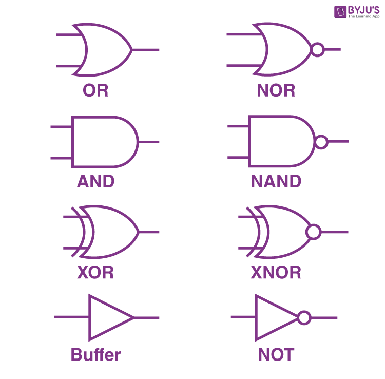

## Introdução à Lógica Booleana e Sistemas Digitais

---

## Questões

- O que é informação?
- Qual é a quantidade mínima de informação que se pode transmitir? 
- [Exemplo de Um Bit](https://www.youtube.com/watch?v=i6LGJ7evrAg)
- [Tabela de caracteres ASCII](https://www.ibm.com/docs/en/aix/7.2?topic=adapters-ascii-decimal-hexadecimal-octal-binary-conversion-table)
- [Código Morse](https://brasilescola.uol.com.br/geografia/codigo-morse.htm)
- [Álgebra Booleana](https://pt.wikipedia.org/wiki/%C3%81lgebra_booliana)

---

## O que é Lógica Booleana?

A lógica booleana é um conceito fundamental na ciência da computação e na matemática, que trata de valores binários: verdadeiro (1) e falso (0). Envolve operações lógicas como E, OU e NÃO, que são usadas para manipular e comparar esses valores binários.

---

 

---

## Noções Básicas de Lógica Digital

Lógica digital refere-se à manipulação de sinais binários em circuitos eletrônicos. É a base da computação moderna e da eletrônica.

### Componentes da Lógica Digital:
- **Portas Lógicas**: Blocos básicos que realizam operações booleanas.
- **Flip-Flops**: Elementos de memória que armazenam informações binárias.
- **Circuitos Combinacionais**: Portas interconectadas que executam funções específicas.

---

## Aplicações da Lógica Booleana em Sistemas Digitais

A lógica booleana é crucial no projeto e implementação de sistemas digitais. Ela nos permite resolver uma ampla gama de problemas de forma eficiente.

### Exemplo 1: Aritmética Binária
A lógica booleana é usada para realizar adição e subtração binária, que são operações fundamentais na aritmética de computadores.

### Exemplo 2: Tomada de Decisões
Sistemas digitais usam expressões booleanas para tomar decisões, como controlar semáforos com base em entradas de sensores.

---

## Aplicações da Lógica Booleana em Sistemas Digitais (Continuação)

### Exemplo 3: Armazenamento de Dados
Unidades de memória em computadores são construídas usando flip-flops, que são controlados pela lógica booleana, permitindo o armazenamento e a recuperação de dados.

### Exemplo 4: Detecção e Correção de Erros
A lógica booleana é empregada para detectar e corrigir erros na transmissão e armazenamento de dados.

---

## Conclusão

A lógica booleana é a base dos sistemas digitais e desempenha um papel crucial na resolução de uma variedade de problemas. Entender a lógica booleana é essencial para qualquer pessoa interessada em ciência da computação e eletrônica.

Lembre-se:
- E, OU, NÃO são operações lógicas básicas.
- Sistemas digitais dependem da lógica booleana para tomada de decisões, aritmética, armazenamento e tratamento de erros.

---

## Desafio

- Pesquise quem foi:
    - George Boole 
    - Augustus De Morgan

---

## Perguntas, dúvidas, comentários

